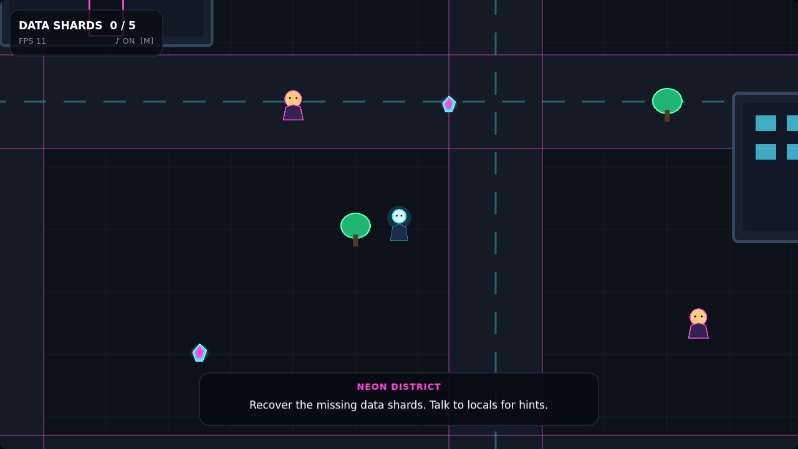
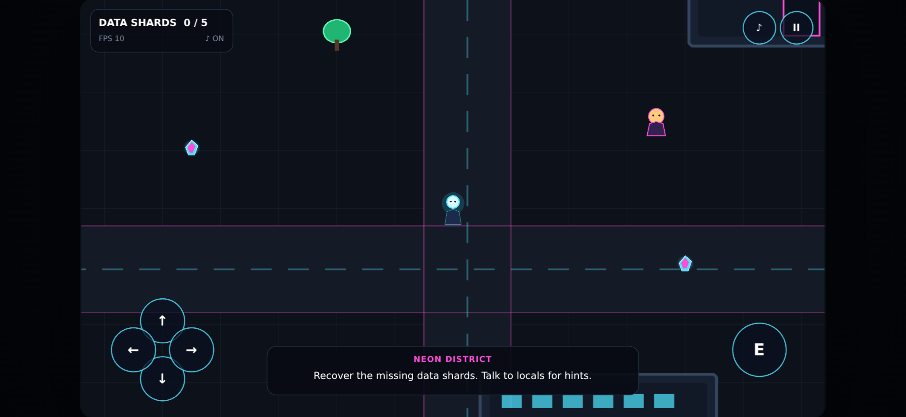

# Neon District

A small top-down game about a neon city at night, built with PixiJS 8 and TypeScript.

Walk the streets, talk to the locals and recover five lost data shards. The game itself is deliberately small. What it is meant to show is what sits underneath: a clean update loop, a spatial grid for collision and interaction queries, object pooling, depth sorting, one input layer for keyboard and touch, and rendering that stays sharp on any screen.

**[Open the live demo](https://stiutin.github.io/pixi-neon-district/)**

<p align="center">
  
  
</p>

## Features

- Five data shards to find, three locals with rotating dialogue lines, and a completion screen
- Keyboard controls bound to physical keys, so WASD works on any layout, including Ukrainian
- On-screen touch controls on phones and tablets, feeding the same input layer as the keyboard
- Pause, sound toggle, fullscreen, and a progress reset that happens in place
- Progress and settings saved in `localStorage`, validated on load
- The game pauses itself when the tab is hidden
- Sharp rendering on HiDPI and 4K screens, letterboxed into any window
- Characters walk in front of and behind buildings, trees and each other
- Particle bursts, a bobbing animation on the shards, and sound effects synthesised with Web Audio
- Deployed to GitHub Pages from CI after every green push

## Tech stack

[PixiJS 8](https://pixijs.com/), TypeScript (strict), [Vite](https://vitejs.dev/), the Web Audio API.
Tested with [Vitest](https://vitest.dev/) and [Playwright](https://playwright.dev/).

## How it works

### The loop and scenes

A `GameLoop` on Pixi's ticker converts elapsed time to seconds and clamps it, so a long frame after a tab switch cannot push the player through a wall. Scenes (loading, then the game) own everything they create and release it when they are replaced. The game scene is a small state machine: playing, paused, completed.

### Collision and interaction

Buildings, trees and characters are indexed in a uniform `SpatialGrid`. A collision or "what can I talk to" query only visits the cells around the player, not the whole city. Cell keys are packed into a single number and queries reuse their output array, so the per-frame path allocates nothing.

Movement is resolved one axis at a time: when the player is blocked horizontally, they still slide along the wall vertically, instead of sticking to it. Diagonal input is normalised, so moving diagonally is not faster. Interacting returns a typed result (a collected shard or a line of dialogue), which the scene handles with an exhaustive `switch`.

### Rendering

The game is designed at 1280×720. Instead of stretching that canvas with CSS, which blurs it on large screens, the `Viewport` raises the renderer's resolution to fit the window and the device pixel ratio, up to a cap. Game and interface code keep working in design coordinates, and text stays sharp.

The world has three layers: the static ground, the entities sorted by the position of their feet, and the effects on top. Particles come from a pool and share one geometry; size and colour change through scale and tint, so spawning one never rebuilds GPU data. Camera smoothing and particle drag are exponential in elapsed time, so the game feels the same at 30, 60 and 144 frames per second.

### Input

`InputManager` maps keys and touch buttons to actions such as `moveUp`, `interact` and `pause`. Several sources can hold the same action at once. Pressed-this-frame queries serve menus, held state serves movement, and a synchronous callback serves the browser APIs that require a real user gesture, such as fullscreen. Browser shortcuts like `Ctrl+R` are left alone.

## Testing

| Layer      | Tool       | What it covers                                                                                 |
| ---------- | ---------- | ---------------------------------------------------------------------------------------------- |
| Unit       | Vitest     | collision maths, the spatial grid, interaction search, save validation, helpers - 28 tests     |
| End-to-end | Playwright | the production build on desktop and mobile: starts without errors, input, saving - 3 scenarios |

The engine-independent parts are unit-tested directly. The end-to-end suite runs against the exact build that gets deployed, on a desktop and a phone viewport, and fails on any uncaught error or console message.

## Project structure

```
src/
├── app/           composition root, Pixi setup, the responsive viewport
├── core/          game loop, scene base class, scene manager
├── scenes/        loading scene, game scene (state machine)
├── world/         world layers, camera, level data
├── entities/      player, locals, buildings, trees, shards
├── spatial/       the uniform grid
├── collision/     collider contract, collision system
├── interaction/   interactable contract, nearest-target search
├── input/         action bindings, keyboard and touch input
├── effects/       pooled particles
├── audio/         synthesised sound effects
├── save/          validated, failure-tolerant saving
├── ui/            HUD, prompt, banner, overlay, touch controls, theme
└── math/          boxes, points, clamping
e2e/               Playwright smoke tests
scripts/           README screenshots
```

## Running locally

Requires Node 22.22.3 or newer (see `.nvmrc`).

```bash
git clone https://github.com/stiutin/pixi-neon-district.git
cd pixi-neon-district
npm ci
npm start
```

Other scripts:

```bash
npm run build          # type check and production build into dist/
npm run serve          # serve the production build
npm test               # unit tests
npm run e2e            # build, then the Playwright tests (run `npm run e2e:install` once)
npm run screenshots    # regenerate the README screenshots
npm run lint           # ESLint and Stylelint
npm run typecheck      # TypeScript
npm run check          # formatting, lint, types and unit tests, as in CI
```

Working on the project with an AI assistant? [`CLAUDE.md`](CLAUDE.md) has the full context.

## Deployment

Pushing to `master` runs formatting, lint, type checks and unit tests, then builds the site and runs the Playwright tests against that build. Only when they pass is the same build published to GitHub Pages. Vite uses a relative `base`, so the files work under `/pixi-neon-district/` without any configuration.

## Roadmap

- [ ] A fixed simulation step with interpolated rendering
- [ ] Walking animations from a spritesheet
- [ ] Levels loaded from Tiled maps, and more than one district
- [ ] A settings menu with key remapping and reduced motion
- [ ] Gamepad support through the same input layer
- [ ] A benchmark page comparing the spatial grid with a brute-force search

## License

Released under the [MIT License](LICENSE).

## Author

**Serge Tiutin** - [github.com/stiutin](https://github.com/stiutin)
