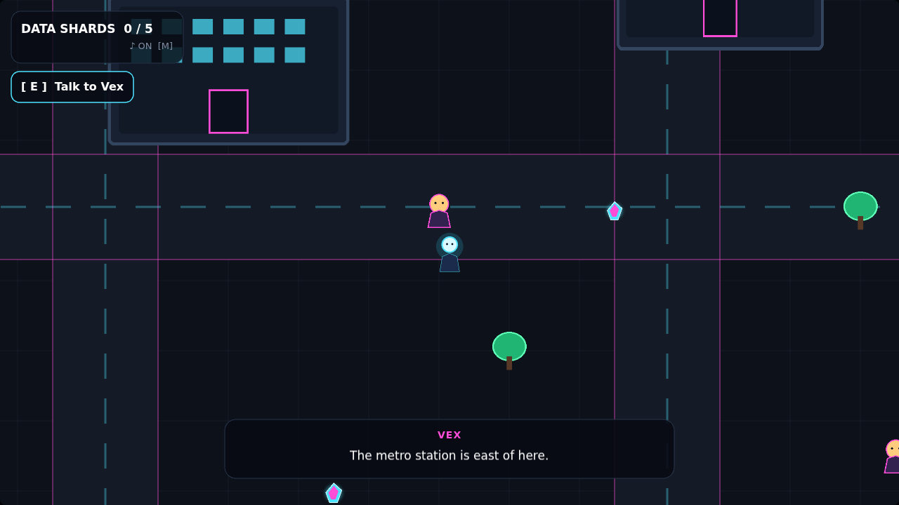
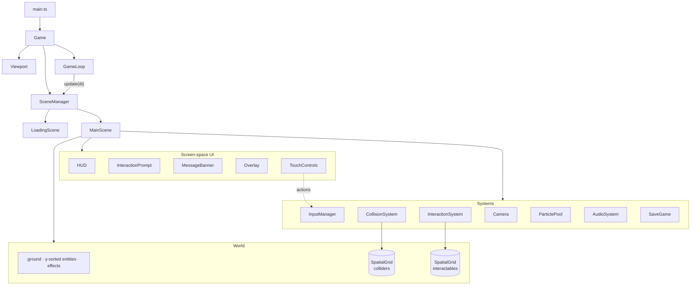

# Neon District

[](https://github.com/stiutin/pixi-neon-district/actions/workflows/ci.yml)


[](LICENSE)

A small top-down 2D exploration game about a neon city at night, built with **PixiJS 8**, **TypeScript** and **Vite**.

The game is intentionally small. The point of the project is the engineering behind it: a clean update loop, spatial queries, object pooling, y-sorted rendering, input abstraction, crisp HiDPI rendering, persistence and tests.

**▶ [Play the live demo](https://stiutin.github.io/pixi-neon-district/)** (works on desktop and mobile)



## Gameplay

Five data shards went dark somewhere in the district. Walk the streets, talk to the locals for hints and recover every shard. Your progress and sound preference are saved in the browser, so you can close the tab and continue later.

| Action         | Keyboard                        | Touch           |
| -------------- | ------------------------------- | --------------- |
| Move           | `W` `A` `S` `D` / arrow keys    | on-screen D-pad |
| Interact       | `E` / `Space` / `Enter`         | **E** button    |
| Pause / resume | `Esc` / `P`                     | **II** button   |
| Sound on / off | `M`                             | **♪** button    |
| Fullscreen     | `F`                             | —               |
| Reset progress | `R` (while paused or completed) | —               |

Keys are bound by physical position (`KeyboardEvent.code`), so movement works on any keyboard layout, including Ukrainian and AZERTY. Touch controls appear automatically on coarse-pointer devices.

## Getting started

Requires **Node.js 22.12+** (see `.nvmrc`).

```bash
npm install
npm run dev        # http://localhost:5173
```

> Open the game through Vite, not by double-clicking `index.html`: the sources use Vite's module pipeline and asset serving.

| Script              | What it does                                         |
| ------------------- | ---------------------------------------------------- |
| `npm run dev`       | Dev server with hot reload                           |
| `npm run build`     | Type-check and build to `dist/`                      |
| `npm run preview`   | Serve the production build locally                   |
| `npm test`          | Run unit tests (Vitest)                              |
| `npm run lint`      | ESLint with `typescript-eslint` strict type-checked  |
| `npm run typecheck` | `tsc -b` in strict mode                              |
| `npm run format`    | Format everything with Prettier                      |
| `npm run check`     | Format check + lint + typecheck + tests (same as CI) |

## Architecture



```text
src/
├── app/          composition root, Pixi setup, responsive viewport
├── core/         game loop, scene base class, scene manager
├── scenes/       loading scene, main gameplay scene (state machine)
├── world/        world layers, camera, level data
├── entities/     player, NPCs, buildings, trees, collectibles
├── spatial/      uniform spatial grid (broad phase)
├── collision/    collider contract, collision system
├── interaction/  interactable contract, nearest-target search
├── input/        action bindings, keyboard + touch input manager
├── effects/      pooled particles
├── audio/        procedural Web Audio sound effects
├── save/         validated, failure-tolerant localStorage persistence
├── ui/           HUD, prompt, banner, overlay, touch controls, theme
├── math/         AABB, points, clamp
└── utils/        small shared helpers
```

## Engineering highlights

**Spatial grid broad phase.** Colliders and interactables live in a uniform grid (`SpatialGrid`). Collision and "what can I interact with" queries only visit nearby cells, not the whole scene. Cell keys are packed into a single integer, and queries can reuse an output array, so the per-frame hot path doesn't allocate.

**Axis-separated collision.** Movement is resolved on X and then on Y. When the player is blocked on one axis, they slide along walls instead of sticking to them. Diagonal input is normalized, so diagonal movement isn't faster.

**Object pooling.** Particle bursts reuse `Particle` instances from a pool, and all particles share one `GraphicsContext`. Size and color change through `scale` and `tint`, so spawning a particle never rebuilds GPU geometry.

**Frame-rate independence.** Delta time is clamped (`maxDeltaTime`) so a long frame can't push entities through walls. Camera smoothing and particle drag are exponential in `dt`, so the game feels the same at 30, 60 or 144 Hz.

**Crisp rendering at any size.** The game is designed at 1280×720. `Viewport` letterboxes it into the window by raising the renderer _resolution_ (fit scale × `devicePixelRatio`, capped) instead of CSS-stretching the canvas. Game and UI code keep using design coordinates, and text stays sharp on 4K and Retina screens.

**Y-sorted entities.** The world has three layers: static ground, a `sortableChildren` entity layer ordered by each object's "feet", and an effects layer. The player correctly walks in front of or behind NPCs, trees and buildings.

**Input as actions.** `InputManager` maps keys and touch buttons to actions (`moveUp`, `interact`, `pause`…). It tracks multiple sources per action, provides edge-triggered `wasPressed`, and exposes `onPress` callbacks for browser APIs that need a real user gesture (Fullscreen, Web Audio). Browser shortcuts such as `Ctrl+R` are left alone.

**Typed interactions.** `interact()` returns a discriminated union (`collected` | `dialogue`), so the scene reacts with an exhaustive `switch` instead of `instanceof` checks.

**Explicit game state.** The main scene is a small state machine (`playing` / `paused` / `completed`). The game auto-pauses when the tab is hidden, and progress resets in place without a page reload.

**Robust persistence.** `SaveGame` validates untrusted JSON field by field and never throws, even when `localStorage` is unavailable (private mode, quota, sandboxed iframe). Storage is injected, so the class is unit-tested.

**Data-driven level.** The map layout lives in `world/level.ts` as plain data, separate from rendering and gameplay code.

**Zero audio assets.** Sound effects are synthesized with the Web Audio API and scheduled on the audio clock.

## Quality

- TypeScript `strict`, plus `noUncheckedIndexedAccess`, `exactOptionalPropertyTypes`, `noImplicitOverride` and `verbatimModuleSyntax`.
- ESLint (`typescript-eslint` strict type-checked) and Prettier.
- Vitest unit tests for the engine-agnostic parts: AABB math, spatial grid, interaction search, save validation and helpers.
- GitHub Actions runs the full check and build on every push and pull request, and deploys `main` to GitHub Pages.

## Ideas for next steps

- Fixed-timestep simulation with render interpolation
- Level loading from Tiled / JSON, and more districts
- Sprite animations (walk cycles) via spritesheets
- `prefers-reduced-motion` support and a settings menu
- Playwright smoke test in CI

## License

[MIT](LICENSE)
